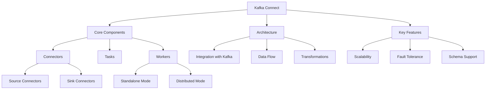

```mermaid
graph TD
    A[Kafka Connect] --> B[Core Components]
    A --> C[Architecture]
    A --> D[Key Features]

    B --> E[Connectors]
    B --> F[Tasks]
    B --> G[Workers]

    E --> H[Source Connectors]
    E --> I[Sink Connectors]
    G --> J[Standalone Mode]
    G --> K[Distributed Mode]

    C --> L[Integration with Kafka]
    C --> M[Data Flow]
    C --> N[Transformations]

    D --> O[Scalability]
    D --> P[Fault Tolerance]
    D --> Q[Schema Support]
```