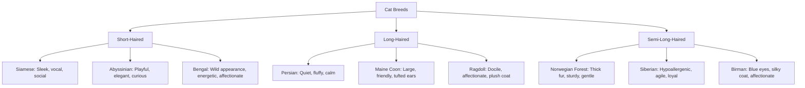

```mermaid
graph TD
    A[Cat Breeds] --> B[Short-Haired]
    A --> C[Long-Haired]
    A --> D[Semi-Long-Haired]
    
    B --> E[Siamese: Sleek, vocal, social]
    B --> F[Abyssinian: Playful, elegant, curious]
    B --> G[Bengal: Wild appearance, energetic, affectionate]
    
    C --> H[Persian: Quiet, fluffy, calm]
    C --> I[Maine Coon: Large, friendly, tufted ears]
    C --> J[Ragdoll: Docile, affectionate, plush coat]
    
    D --> K[Norwegian Forest: Thick fur, sturdy, gentle]
    D --> L[Siberian: Hypoallergenic, agile, loyal]
    D --> M[Birman: Blue eyes, silky coat, affectionate]
```