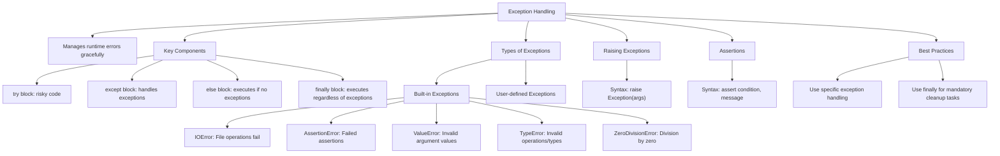

```mermaid
graph TD
    ExceptionHandling["Exception Handling"]
    ExceptionHandling --> Definition["Manages runtime errors gracefully"]
    ExceptionHandling --> Components["Key Components"]
    Components --> Try["try block: risky code"]
    Components --> Except["except block: handles exceptions"]
    Components --> Else["else block: executes if no exceptions"]
    Components --> Finally["finally block: executes regardless of exceptions"]
    ExceptionHandling --> ExceptionTypes["Types of Exceptions"]
    ExceptionTypes --> BuiltIn["Built-in Exceptions"]
    BuiltIn --> IOError["IOError: File operations fail"]
    BuiltIn --> AssertionError["AssertionError: Failed assertions"]
    BuiltIn --> ValueError["ValueError: Invalid argument values"]
    BuiltIn --> TypeError["TypeError: Invalid operations/types"]
    BuiltIn --> ZeroDivisionError["ZeroDivisionError: Division by zero"]
    ExceptionTypes --> Custom["User-defined Exceptions"]
    ExceptionHandling --> Raising["Raising Exceptions"]
    Raising --> RaiseSyntax["Syntax: raise Exception(args)"]
    ExceptionHandling --> Assertion["Assertions"]
    Assertion --> AssertSyntax["Syntax: assert condition, message"]
    ExceptionHandling --> GoodPractices["Best Practices"]
    GoodPractices --> SpecificExcept["Use specific exception handling"]
    GoodPractices --> FinallyUse["Use finally for mandatory cleanup tasks"]
```