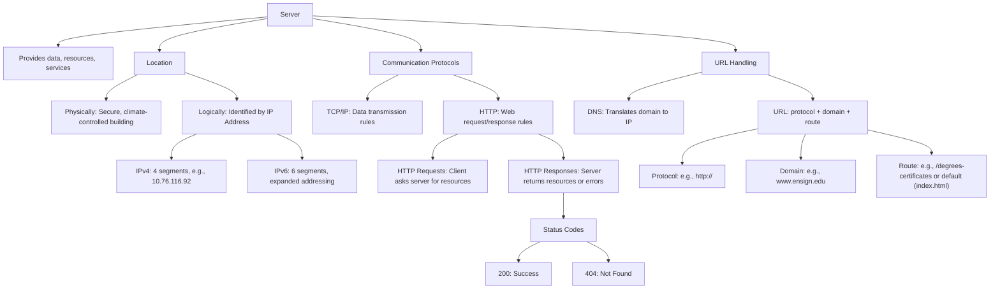

```mermaid
graph TD
    Server["Server"]
    Server --> Definition["Provides data, resources, services"]
    Server --> Location["Location"]
    Location --> Physical["Physically: Secure, climate-controlled building"]
    Location --> Logical["Logically: Identified by IP Address"]
    Logical --> IPv4["IPv4: 4 segments, e.g., 10.76.116.92"]
    Logical --> IPv6["IPv6: 6 segments, expanded addressing"]
    Server --> Protocols["Communication Protocols"]
    Protocols --> TCPIP["TCP/IP: Data transmission rules"]
    Protocols --> HTTP["HTTP: Web request/response rules"]
    HTTP --> Requests["HTTP Requests: Client asks server for resources"]
    HTTP --> Responses["HTTP Responses: Server returns resources or errors"]
    Responses --> StatusCodes["Status Codes"]
    StatusCodes --> Success["200: Success"]
    StatusCodes --> NotFound["404: Not Found"]
    Server --> URLHandling["URL Handling"]
    URLHandling --> DNS["DNS: Translates domain to IP"]
    URLHandling --> URL["URL: protocol + domain + route"]
    URL --> Protocol["Protocol: e.g., http://"]
    URL --> Domain["Domain: e.g., www.ensign.edu"]
    URL --> Route["Route: e.g., /degrees-certificates or default (index.html)"]
```